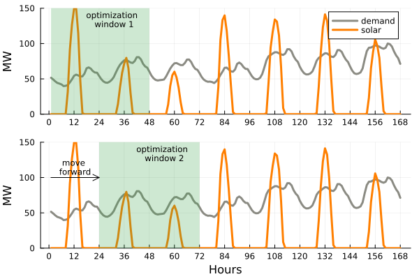

# Rolling Horizon Example

Example of a rolling horizon application for a power system optimization model using [Julia](https://julialang.org/), [JuMP](https://jump.dev/), and [ParametricOptInterface.jl](https://github.com/jump-dev/ParametricOptInterface.jl).

The example is available in this repository's notebook file [Pluto-nb-POI.jl](Pluto-nb-POI.jl). To run it, please first run [Pluto](https://plutojl.org/) in your Julia console and then open the notebook in the Pluto environment.

Here is a graph briefly representing the rolling horizon application in the notebook.

